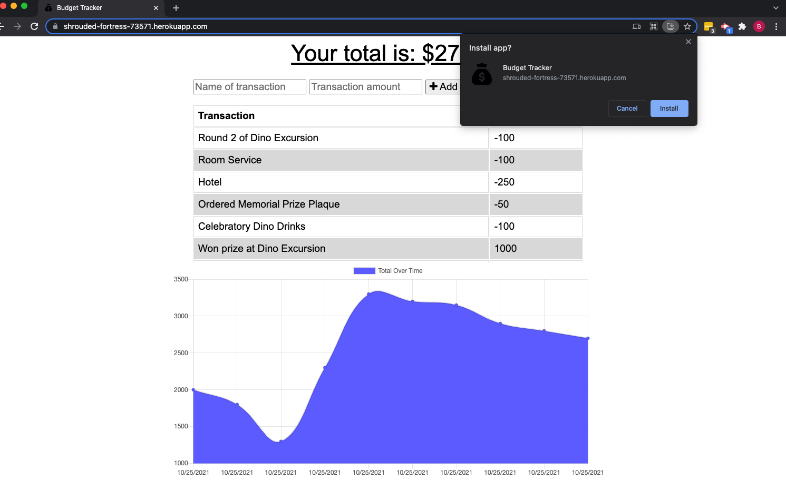
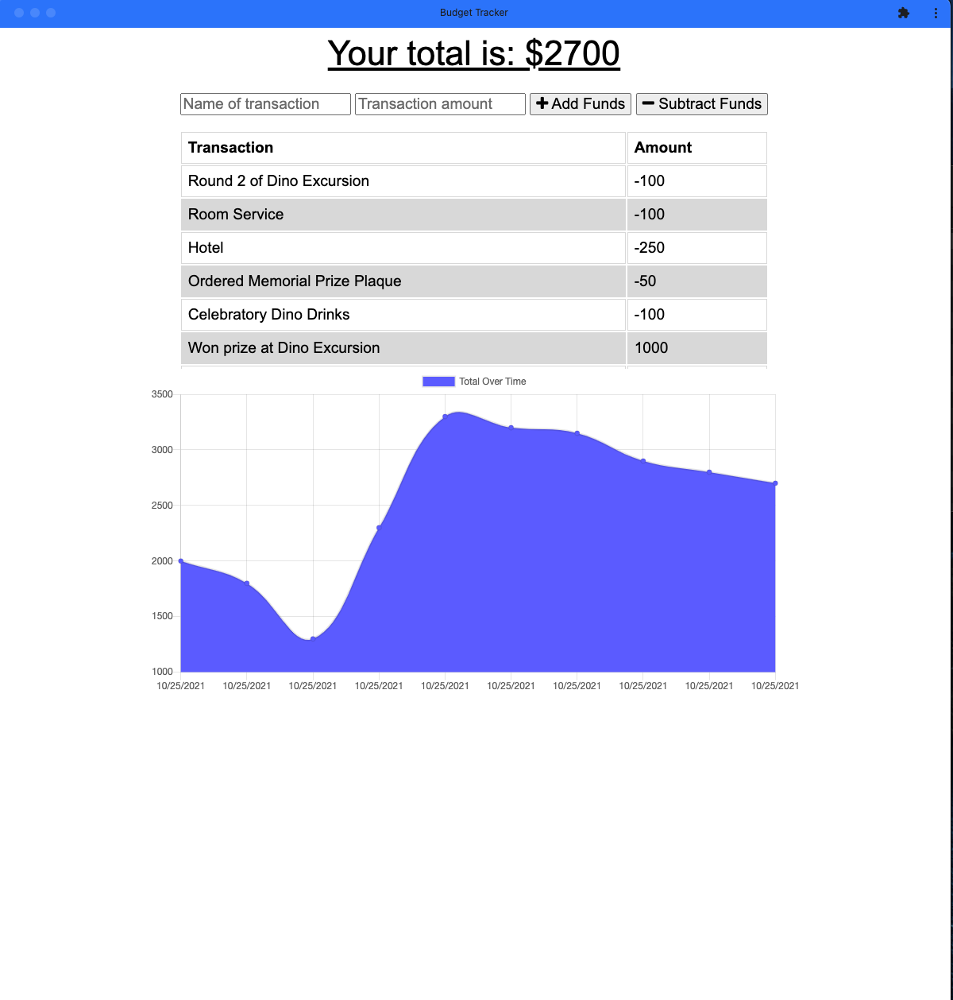

# PWA-Budget-Tracker

(https://shrouded-fortress-73571.herokuapp.com/)

## Description
This project is a conversion of a provided budget tracking application codebase to become a Progressive Web Application, with downloadable App-like interface and offline functionality. In doing so, here are the technologies used:

- JavaScript
- IndexedDB
- Service Workers and Web Manifest for offline/PWA functionality
- (provided code also utilized a MongoDB/Mongoose database setup running on an express server through node)

## Table of Contents
* [Usage](#usage)
* [Installation](#installation)
* [Credits](#credits)
* [License](#license)
* [Contributing](#contributing)
* [Tests](#tests)
* [Questions](#questions)

## Installation
To interact with this application without running your own server on your local machine, use the deployed link through Heroku. Follow the usage instructions section for details on using this application as a PWA.

For personal/local use: use the command 'git clone' in your command line with the link of this repo while navigated to your desired directory to copy this repo to your machine, run 'npm install' or 'npm i' in your command line in the root folder of this application to install dependencies required. (note: it is not recommended to update the version of these dependencies, in order to ensure maximum compatability) Here's how to install:

    * In your command line, navigate to the desired location for this repo directory.
    * Use the command 'git clone' in your command line with the link of this repo to copy into your local machine.
    * Navigate into the newly cloned directory in your command line.
    * Run 'npm install' or 'npm i' in your command line while still in the root folder of this application to install dependencies required.
    * Check the manifest.json and service-worker.js files to ensure that the files you'd like to cache and/or utilize for PWA are linked in the appropriate places.

## Usage
To track spending and where you are at on your trip budget, use the interface to input the description and amount, then subtract/add that to your budget. Results will be saved to the connected MongoDB database. While offline, results will be saved in the browser's indexedDB database, submitted to the MongoDB database upon return to internet connectivity. To utilize the PWA functionality:

    * Visit the deployed web address.
    * Click the icon by the address bar that upon hover says "Install Budget Tracker".
    * Follow screen instructions, and you will have the app downloaded to the device. 

### Deployed Link and Screenshots
[Click Here for Deployed Application](https://shrouded-fortress-73571.herokuapp.com/)

## Credits
The user guidelines and starter code for this budget tracking application were given by Trilogy Education as a part of the University of Kansas Full Stack Web Developer Bootcamp. © 2021 Trilogy Education Services, LLC, a 2U, Inc. brand. Confidential and Proprietary. All Rights Reserved. The idb.js, service-worker.js, and manifest.json files were created by Brian Wilde, with references to class module work also provided by Trilogy Education (see above).

## License

### MIT LICENSE

Permission is hereby granted, free of charge, to any person obtaining a copy
of this software and associated documentation files (the "Software"), to deal
in the Software without restriction, including without limitation the rights
to use, copy, modify, merge, publish, distribute, sublicense, and/or sell
copies of the Software, and to permit persons to whom the Software is
furnished to do so, subject to the following conditions:

The above copyright notice and this permission notice shall be included in all
copies or substantial portions of the Software.

THE SOFTWARE IS PROVIDED "AS IS", WITHOUT WARRANTY OF ANY KIND, EXPRESS OR
IMPLIED, INCLUDING BUT NOT LIMITED TO THE WARRANTIES OF MERCHANTABILITY,
FITNESS FOR A PARTICULAR PURPOSE AND NONINFRINGEMENT. IN NO EVENT SHALL THE
AUTHORS OR COPYRIGHT HOLDERS BE LIABLE FOR ANY CLAIM, DAMAGES OR OTHER
LIABILITY, WHETHER IN AN ACTION OF CONTRACT, TORT OR OTHERWISE, ARISING FROM,
OUT OF OR IN CONNECTION WITH THE SOFTWARE OR THE USE OR OTHER DEALINGS IN THE
SOFTWARE.

## Contributing
No contributing guidelines currently

## Tests
No tests at this time

## Questions
You can find my GitHub profile at https://github.com/bgswilde
For any further questions, reach out to me via email at bgswilde@gmail.com.